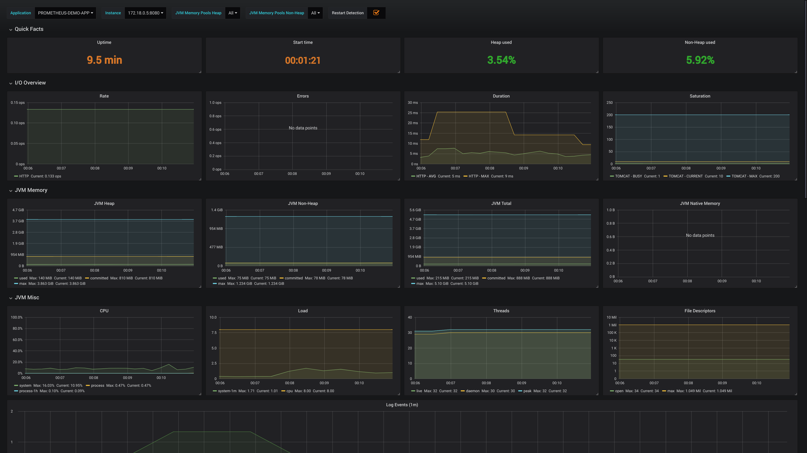

# Prometheus with Spring Boot using service discovery via Eureka 

**Update: Prometheus now natively support Eureka as a service discovery mechanism.**

See: [Prometheus Config for Eureka](https://prometheus.io/docs/prometheus/latest/configuration/configuration/#eureka_sd_config)

A previous version of this project used [Eureka Consul Exporter](https://github.com/twinformatics/eureka-consul-adapter) 
to expose Eureka metadata via Consul apis and using Consul metadata.

This was before Eureka was added as a discovery mechanism for Prometheus.

That code can still be found on the _consul_adapter_ branch of this project.

To build use: `mvn clean package`

Then `docker-compose up` to bring up

* Prometheus (port 9090)
* Grafana (port 3000)
* Blackbox Exporter (port 9115)
* Eureka (port 8761)
* Spring Boot Demo app registered with Eureka (port 8080)

Go to [Grafana Dashboard](http://localhost:3000/d/n9TP6fNmk/jvm-micrometer?refresh=5s&orgId=1&from=now-15m&to=now&var-application=PROMETHEUS-DEMO-APP)

to see a dashboard with the currently discovered applications. (allow a minute of two for some data to be collected)

(username/password is admin/admin)

Dashboard taken from https://grafana.com/dashboards/4701

The Prometheus config has two service discovery config sections.
One for monitoring metrics via the application's /actuator/prometheus endpoint, the other for monitoring the 
application via the blackbox exporter, which pings the application's /actuator/health endpoint.

This isn't entirely necessary, but is sometimes useful to probe an application both internally (whitebox monitoring) and externally (blackbox monitoring).
